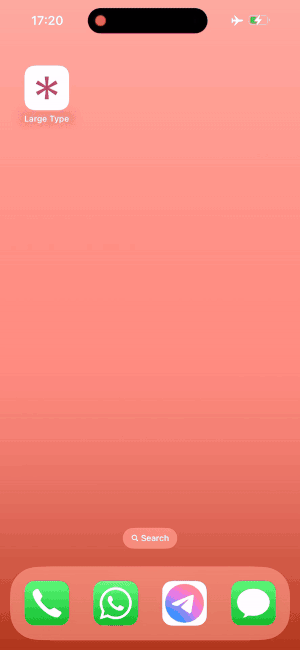
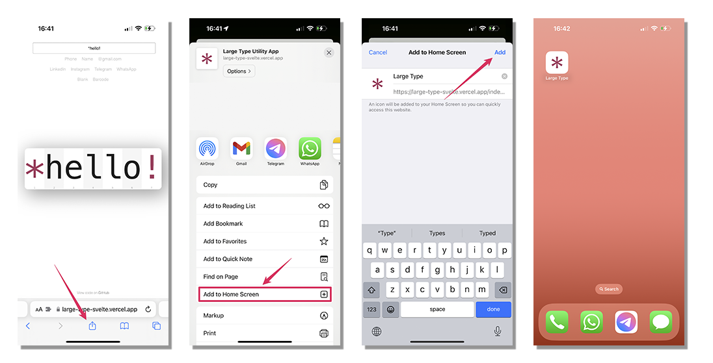

# Display and share text in a large font, directly from your browser or phone!

Large-type.com is a utility website that lets you **display & share text in a very large font** directly from your browser or phone.

That's handy whenever you need to **read something on your screen from further away**—for example, phone numbers and passwords.


## Features
There are a few links that you can click to easily pre-fill your name and other personal data on your computer or phone's screen. For this to work, it is expected that you clone the project and make changes to it to have the links pre-fill the text with your own data.

The links included in this project are:
  - name
  - address
  - phone
  - email placeholder (`@gmail.com` for example)
  - blank (clicking on this link clears the input)
  - barcode: generates a barcode from the input text
  - show a QR code linking to a LinkedIn profile
  - show a QR code linking to a Instagram profile
  - show a QR code linking to a Telegram profile
  - show a QR code linking to a WhatsApp profile



### Why QR codes for socials?
Sometimes you meet someone at an event or conference and want to connect with them. Having the person simply open their camera app and scan your QR code is fast and efficient, as you don't need to fuss around each app to find where they moved the button to show the QR code on the last update. Simply ask the other person to scan your QR codes from the Large Type app with their camera, and their phone will open the correct app to connect with you.


### Ok, but why a Barcode generator? 🤔
Ok, I admit this one comes from a very niche use-case that I had a few times and decided to have an easy way to solve it. If you purchase things online that get delivered through DHL and they try to deliver when you're not home, they might put it into a **Packstation**, and send you a paper with the code to retrieve it. The problem is: they'll put your package in the Packstation, and send you the code **later** via post, which can take some days to arrive at your address. However, you can go to DHL's chatbot and talk with it until it gives you the pickup code right away. Sure, you can type the code manually into the Packstation, but that can be hard and annoying when the low-quality touch screen on those machines gets damaged (which is the case of the Packstation closest to my location), so that's the main reason why I included a Barcode generator on the app, to be able to show the barcode from my phone and have the machine scan it instead of struggling to type all the digits on a damaged, low quality touch screen.


### How to add it to your phone screen
To add the app to your phone's home screen, follow these steps:

 - open your phone's **default browser** app.

 - go to https://large-type-svelte.vercel.app (or the URL of your own instance of the app).

 - if you're on iOS, click on the share icon on Safari (might look different on Android devices) and then choose "Add to Home Screen"

 - confirm by clicking on "Add" and it should now be available as an app in your home screen!



That's it! Now you have the Large Type utility easily available in your phone, and the best part is: it works even when your phone is offline! _(you must open the app at least once while online so that it can cache the required files to work offline)_


## How does it work?
All text formatting and rendering happen locally on your browser/phone through CSS and JavaScript. Your text is not transmitted to any servers, **ever**.

Additionally, this project is open-source, which means you can audit the source code to see that your data isn't sent or stored anywhere else.


### Creating your own QR codes that point to your social profiles
If you are knowledgeable with image editing softwares such as Adobe Photoshop and know how to create the QR codes for your social profiles, feel free to use the included [Badge ID template file](misc/Badge_Template.psd) to create your own QR code images.


## Local Development & Preview
Spin up a local development server:

```bash
npm install
npm run dev
```

Then open http://localhost:5173/ to preview.


## 💖 Support the project
If you find this _Progressive Web App_ useful and want to support my work, consider [supporting me on Ko-fi](https://ko-fi.com/lily_neinhorn). Your support enables me to continue creating helpful tools for the community! 💖

<br />

<div align="center">
    <a href="https://ko-fi.com/lily_neinhorn" target="_blank">
        
    </a>
</div>

<br />
<br />

---

This project was initially forked from [https://github.com/dbader/large-type.com](https://github.com/dbader/large-type.com).